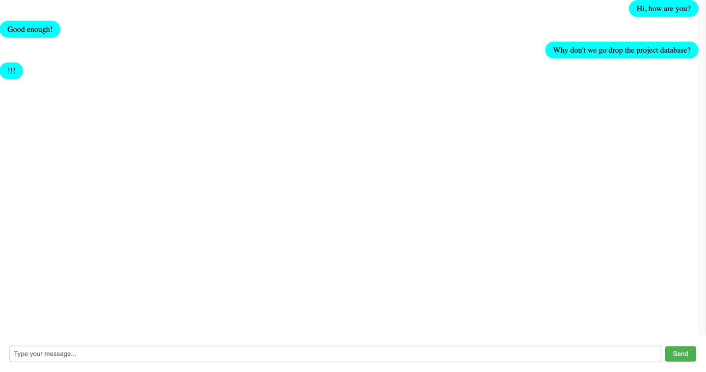

# Soketi With Laravel And Vue

### Laravel Vue Demo chat app without database, just to test web socket

```bash
  git clone https://github.com/NayThuKhant/Soketi-With-Laravel-And-Vue.git
  cd Soketi-With-Laravel-And-Vue
  cp .env.example .env #configure your .env after this step
  composer install
  php artisan key:generate
  npm install
```

And boom! Your chat application is ready.

### This is not a repository to learn clean-code, just to explore how to setup things related to soketi. Workflows can be found below.
- [Laravel Workflow](routes/api.php)
- [Broadcasting Config](config/broadcasting.php)
- [Vue.Js Workflow](resources/js/App.vue)
